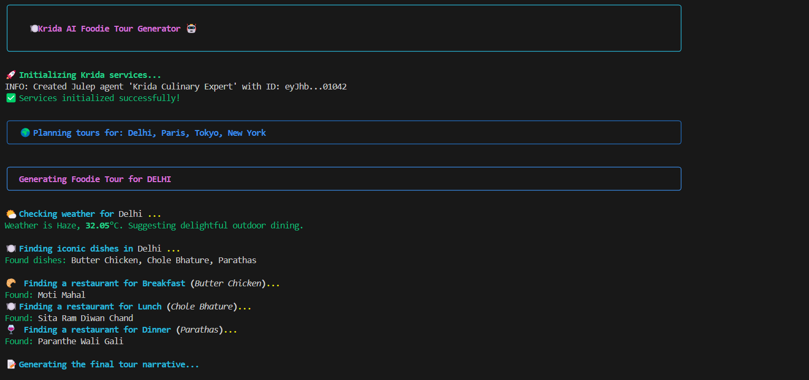
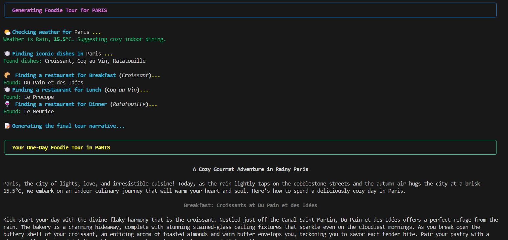

# Krida: AI-Powered Foodie Tour Generator v1.0.2


<p align="center">
  <!-- Logo Start -->
  
  <!-- Logo End -->
  </p>
  <br/>
<p align="center">
  
  
  
</p>

> *"Krida"* (Sanskrit: क्रीडा) means "play" or "sport" – because exploring food should be a delightful adventure!

Krida is an **open-source** Python-based AI workflow that generates personalized, one-day "foodie tours" for any city. The interactive v1.0.2 update removes hardcoded cities and introduces a beautiful menu system where users can select their own destinations and budget preferences. It intelligently combines real-time weather data with the creative power of Julep AI to craft engaging, practical, and narrative-driven culinary itineraries.

---

## 🎉 What's New in v1.0.2

**🎨 Enhanced User Experience:**
- Beautiful ASCII art welcome screen with improved branding
- Contextual city suggestions (Popular choices, Food capitals, Hidden gems)
- Enhanced input validation with helpful error messages
- Progress tracking with spinners and status indicators

**🧠 Smart Budget Processing:**
- Natural language support: "cheap", "expensive", "moderate", "luxury"
- Flexible input: accepts numbers, keywords, or descriptive phrases
- Intelligent mapping to appropriate budget categories
- Custom amount support with currency symbol handling

**💬 Better User Interaction:**
- Enhanced confirmation screen with detailed tour summary
- Multiple navigation options (Continue, Modify, Quit)
- Improved error handling with recovery suggestions
- Keyboard interrupt handling for graceful exits

**🚀 Performance & Reliability:**
- Better API error handling and user feedback
- Enhanced service initialization with status updates
- Improved city name formatting and validation
- More robust tour generation with fallback options

---

## ✨ Features

- **📱 Enhanced Interactive Menu System**: Beautiful ASCII art, helpful tips, and intuitive navigation
- **🌍 Smart City Selection**: Choose any cities worldwide with input validation, formatting, and contextual suggestions  
- **💰 Advanced Budget Options**: Select from tiers OR use natural language like "cheap", "expensive", "moderate"
- **🎨 Beautiful Terminal UI**: Rich formatting with colorful panels, progress tracking, and markdown rendering
- **🌤️ Weather-Smart Planning**: Suggests indoor or outdoor dining based on live weather conditions
- **🍛 Authentic Cuisine Focus**: Discovers genuine local dishes, not generic tourist options
- **⭐ Budget-Conscious Restaurants**: Finds top-rated establishments that match your exact budget
- **📖 Narrative-Driven Tours**: Crafts engaging, blog-style stories for your culinary journey
- **🏙️ Multi-City Support**: Plan tours across multiple destinations with progress tracking
- **🛠️ Modular & Extensible**: Easy to add new features, APIs, or customize for different regions

---

## 🚀 Workflow Logic

Krida v1.0.2 features an interactive workflow that starts with user input:

**Interactive Setup:**
1. **📱 Welcome & Enhanced Menu**  
   Beautiful interactive interface with ASCII art, helpful tips, and user-friendly city selection with suggestions.
2. **🌍 Smart City Selection**  
   Choose any cities worldwide with input validation, formatting, and helpful examples.
3. **💰 Advanced Budget Configuration**  
   Select from budget tiers OR use natural language like "cheap", "expensive", "moderate", or enter custom dollar amounts.
4. **✅ Interactive Confirmation**  
   Review your selections with beautiful formatting and multiple options to proceed, modify, or quit.

**For each selected city, Krida executes:**
1. **🌤️ Weather Check**  
   Fetches current weather conditions using the OpenWeather API.
2. **🏠 Dining Suggestion**  
   Suggests indoor or outdoor dining based on temperature and weather (e.g., rain).
3. **🍽️ Budget-Aware Dish Discovery**  
   Uses Julep AI (`gpt-4o` model) to identify three iconic local dishes that fit your budget.
4. **🔍 Smart Restaurant Search**  
   For each dish, queries Julep AI to find budget-appropriate, top-rated, authentic restaurants.
5. **📝 Enhanced Narrative Generation**  
   All collected data (weather, budget, dining style, dishes, restaurants) is passed to Julep AI, which generates a creative, blog-style tour guide narrative with budget considerations.

---

## 🗂️ Project Structure

```
krida/
├── LICENSE
├── README.md
├── main.py
├── requirements.txt
├── .gitignore
├── .env.example
├── assets/
│   └── images/
│       ├── krida_logo.png
│       ├── sample_output_0.png
│       └── sample_output_1.png
└── services/
   ├── julep_service.py
   └── weather.py
```

---

## 🏗️ Architecture

<p align="center">
  
  
  
</p>

```
🤖 AI Agent (Foodie Guide)
    ↓
⚙️ YAML-based Task Workflow
    ├── 🌤️ Weather Integration (OpenWeather API)
    ├── 🍛 Local Dish Discovery (Julep AI)
    ├── ⭐ Restaurant Search (Julep AI)
    └── 📝 Tour Narrative Creation (Julep AI)
```

- **Julep Client**: Modern `Julep(api_key="...")` initialization.
- **YAML Task Definitions**: Structured, extensible workflow definitions.
- **Integration Tools**: Weather and search providers.
- **Expression Syntax**: New `$` syntax for variables in YAML.

---

## 🧑‍💻 Tech Stack

- **Language**: Python 3.9+
- **Core APIs**:
  - [Julep AI](https://julep.ai/) for all LLM-based tasks (dish discovery, restaurant search, narrative generation)
  - [OpenWeather API](https://openweathermap.org/api) for real-time weather data
- **Primary Libraries**: `requests`, `julep-ai`, `PyYAML`, `pydantic`, `rich`

---

## ⚡ Quick Start

1. **Clone and Setup**
   ```bash
   git clone https://github.com/ayushmorbar/krida.git
   cd krida
   pip install -r requirements.txt
   ```

2. **Configure Environment**
   ```bash
   cp .env.example .env
   # Add your Julep API key and OpenWeather API key to .env
   ```

3. **Run Your First Tour**
   ```bash
   python main.py
   ```

---

## 🏆 Example Output

### Beautiful Terminal Experience with Rich Formatting

Krida features a stunning terminal interface with colorful panels, emojis, and markdown-rendered narratives:

**Application Startup & City Planning**


**City Tour Generation & Narrative Output**


### ✨ What You'll See:

- **📱 Interactive Setup**: User-friendly menus for city and budget selection
- **🎨 Rich Terminal UI**: Colorful panels and progress indicators
- **🌍 Custom City Planning**: Tours for any cities you choose worldwide
- **💰 Budget-Aware Recommendations**: Restaurants and dishes that match your budget
- **🌤️ Weather Integration**: Real-time weather affects dining suggestions
- **🍽️ Authentic Cuisine**: Local dishes appropriate for your budget level
- **📖 Beautiful Narratives**: Markdown-formatted stories with budget considerations

<details>
<summary>📜 Click to expand sample Paris narrative text</summary>

```markdown
# A Cozy Gourmet Adventure in Rainy Paris

Paris, the city of lights, love, and irresistible cuisine! Today, as the rain lightly taps on the cobblestone streets and the autumn air hugs the city at a brisk 15.5°C, we embark on an indoor culinary journey that will warm your heart and soul. Here's how to spend a deliciously cozy day in Paris.

## Breakfast: Croissants at Du Pain et des Idées

Kick-start your day with the divine flaky harmony that is the croissant. Nestled just off the Canal Saint-Martin, Du Pain et des Idées offers a perfect refuge from the rain. The bakery is a charming hideaway, complete with stunning stained-glass ceiling fixtures that sparkle even on the cloudiest mornings. As you break open the buttery shell of your croissant, an enticing aroma of toasted almonds and warm butter envelops you, beckoning you to savor each tender bite.

## Lunch: Coq au Vin at Le Procope

As the afternoon unfolds with gentle raindrops creating a romantic symphony, make your way to Le Procope for an authentic Coq au Vin experience. This historic restaurant, with its warm wooden interiors and flickering candlelight, provides the perfect sanctuary from the Parisian drizzle.

## Dinner: Ratatouille at Le Meurice

End your culinary journey at the elegant Le Meurice, where ratatouille transforms from a simple peasant dish into a work of art. As the rain continues its gentle patter against the restaurant's grand windows, you'll find yourself immersed in layers of perfectly seasoned vegetables that celebrate the essence of French countryside cooking.
```

</details>

---

## 🤝 Contributing

We welcome contributions! Please feel free to submit a Pull Request. For major changes, please open an issue first to discuss what you would like to change.

---

## 📝 License

Apache 2.0 License – see LICENSE file for details.

---

<p align="center">
<p align="center">
    <a href="https://github.com/Offbeatshq/" title="Offbeats Labs">
        
    </a>
</p>

**Built with [Julep AI](https://julep.ai) 🤖 | Crafted by [Offbeats Labs](https://github.com/Offbeatshq/) 🚀**  
Open source project by [ayushmorbar](https://github.com/ayushmorbar) 💻

*Ready to explore the world through food with the latest AI technology? Let Krida be your intelligent culinary guide!* 🌍🍽️